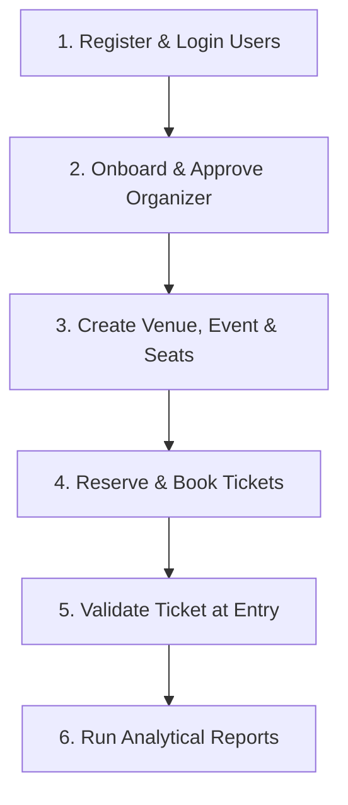

# Event Ticket Booking Platform - REST API Specification

This documentation outlines the complete API contract for the Event Ticket Booking backend. The backend is built using Node.js, Express, PostgreSQL, and Sequelize ORM.

## 1. System Design & Security Overview

### Base URLs
* **API Version 1 Endpoint**: `http://localhost:5001/api/v1`
* **Health Check Probe**: `http://localhost:5001/health`

### Authentication Model
All protected endpoints require an `Authorization` header containing a valid JWT token matching the Bearer prefix scheme:
```http
Authorization: Bearer <JWT_TOKEN>
```

### Role-Based Access Control (RBAC) Matrix
The application implements strict role-based permission validation.

| Role | Description | Core Granted Permissions |
| :--- | :--- | :--- |
| **`super_admin`** | Platform owner | Bypasses all permission checks (access to role/permission modifications, admin creations) |
| **`admin`** | System manager | `manage_organizers`, `manage_venues`, `view_venues`, `manage_events`, `view_events`, `manage_seats`, `view_seats`, `manage_bookings`, `view_bookings`, `manage_tickets`, `view_tickets`, `view_dashboard`, `view_reports` |
| **`organizer`** | Event host / planner | `view_venues`, `manage_events`, `manage_venues`, `view_events`, `manage_seats`, `view_seats`, `view_bookings`, `manage_tickets`, `view_tickets`, `view_dashboard`, `view_reports` |
| **`customer`** | Ticket buyer | `view_events`, `view_seats`, `create_bookings`, `view_bookings`, `view_tickets`, `view_dashboard` |

---

## 2. Standard Response Formats

The API guarantees a consistent envelope structure for all responses.

### Success Response Envelope
```json
{
  "success": true,
  "statusCode": 200,
  "message": "Operation completed successfully",
  "data": {} 
}
```

### Error Response Envelope
```json
{
  "success": false,
  "message": "Error details and description string",
  "stack": "Stack trace (enabled only in development mode)"
}
```

---

## 3. API Endpoint Reference

### 3.1 Authentication & Password Flow

#### `POST /auth/register`
Register a new customer account.
* **Authentication**: None
* **Request Body**:
  ```json
  {
    "name": "Alex Johnson",
    "email": "alex.johnson@example.com",
    "password": "securepassword123"
  }
  ```
* **Success Response (201 Created)**:
  ```json
  {
    "success": true,
    "statusCode": 201,
    "message": "User registered successfully",
    "data": {
      "user": {
        "id": 10,
        "name": "Alex Johnson",
        "email": "alex.johnson@example.com",
        "role": "customer",
        "permissions": ["view_events", "view_seats", "create_bookings", "view_bookings", "view_tickets", "view_dashboard"]
      },
      "token": "eyJhbGciOiJIUzI1NiIsInR5cCI6IkpXVCJ9..."
    }
  }
  ```

#### `POST /auth/login`
Authenticate a user and get a JWT token.
* **Authentication**: None
* **Request Body**:
  ```json
  {
    "email": "alex.johnson@example.com",
    "password": "securepassword123"
  }
  ```
* **Success Response (200 OK)**:
  ```json
  {
    "success": true,
    "statusCode": 200,
    "message": "User logged in successfully",
    "data": {
      "user": {
        "id": 10,
        "name": "Alex Johnson",
        "email": "alex.johnson@example.com",
        "role": "customer",
        "permissions": ["view_events", "view_seats", "create_bookings", "view_bookings", "view_tickets", "view_dashboard"]
      },
      "token": "eyJhbGciOiJIUzI1NiIsInR5cCI6IkpXVCJ9..."
    }
  }
  ```

#### `POST /auth/forgot-password`
Request a temporary verification token to reset a forgotten password.
* **Authentication**: None
* **Request Body**:
  ```json
  {
    "email": "alex.johnson@example.com"
  }
  ```
* **Success Response (200 OK)**:
  ```json
  {
    "success": true,
    "statusCode": 200,
    "message": "Password reset token generated successfully",
    "data": {
      "message": "Password reset token generated. Please use the token below to reset your password.",
      "resetToken": "RST-A9B8C7"
    }
  }
  ```

#### `POST /auth/reset-password`
Reset account password using the generated token.
* **Authentication**: None
* **Request Body**:
  ```json
  {
    "email": "alex.johnson@example.com",
    "token": "RST-A9B8C7",
    "newPassword": "brandnewpassword987"
  }
  ```
* **Success Response (200 OK)**:
  ```json
  {
    "success": true,
    "statusCode": 200,
    "message": "Password reset successfully",
    "data": {
      "message": "Your password has been successfully updated."
    }
  }
  ```

---

### 3.2 Organizer Onboarding (Admin Actions)

> [!NOTE]
> All organizer endpoints accept both plural `/organizers` and singular `/organizer` path formats.

#### `POST /organizers`
Onboard a new organizer profile.
* **Authentication**: Any Authenticated User (requires `Authorization: Bearer <JWT>`)
* **Request Body**:
  ```json
  {
    "userId": 5,
    "companyName": "Phoenix Entertainment Ltd.",
    "contactEmail": "info@phoenixent.com",
    "contactPhone": "+15550199",
    "website": "https://phoenixent.com",
    "address": "100 Broadway Suite 4"
  }
  ```
* **Success Response (201 Created)**:
  ```json
  {
    "success": true,
    "statusCode": 201,
    "message": "Organizer profile created successfully",
    "data": {
      "id": 3,
      "userId": 5,
      "companyName": "Phoenix Entertainment Ltd.",
      "contactEmail": "info@phoenixent.com",
      "contactPhone": "+15550199",
      "website": "https://phoenixent.com",
      "address": "100 Broadway Suite 4",
      "user": {
        "id": 5,
        "name": "Organizer Owner",
        "email": "owner@phoenixent.com"
      }
    }
  }
  ```

#### `POST /organizers/:id/approve`
Approve an onboarded organizer application. Updates user to `isActive: true` and sets role to `organizer`.
* **Authentication**: Required (`manage_organizers`)
* **Success Response (200 OK)**:
  ```json
  {
    "success": true,
    "statusCode": 200,
    "message": "Organizer approved successfully",
    "data": {
      "id": 3,
      "companyName": "Phoenix Entertainment Ltd."
    }
  }
  ```

#### `POST /organizers/:id/suspend`
Suspend an active organizer. Sets the underlying user profile `isActive` flag to `false`.
* **Authentication**: Required (`manage_organizers`)
* **Success Response (200 OK)**:
  ```json
  {
    "success": true,
    "statusCode": 200,
    "message": "Organizer suspended successfully",
    "data": {
      "id": 3,
      "companyName": "Phoenix Entertainment Ltd."
    }
  }
  ```

#### `POST /organizers/:id/reject`
Reject organizer application, deleting the profile and reverting the user's role to customer.
* **Authentication**: Required (`manage_organizers`)
* **Success Response (200 OK)**:
  ```json
  {
    "success": true,
    "statusCode": 200,
    "message": "Organizer application rejected successfully",
    "data": {
      "message": "Organizer application has been rejected and the profile was removed."
    }
  }
  ```

#### `GET /organizers`
List all onboarded organizers.
* **Authentication**: Required (`manage_organizers`)
* **Success Response (200 OK)**:
  ```json
  {
    "success": true,
    "statusCode": 200,
    "message": "Organizers fetched successfully",
    "data": [
      {
        "id": 3,
        "companyName": "Phoenix Entertainment Ltd.",
        "contactEmail": "info@phoenixent.com"
      }
    ]
  }
  ```

---

### 3.3 Venue Management

> [!NOTE]
> All venue endpoints accept both plural `/venues` and singular `/venue` path formats.

#### `POST /venues`
Create a new venue layout configuration.
* **Authentication**: Required (`manage_venues`)
* **Request Body**:
  ```json
  {
    "name": "Grand Metro Arena",
    "address": "450 Olympic Boulevard",
    "city": "Denver",
    "state": "CO",
    "country": "USA",
    "zipCode": "80201",
    "capacity": 15000
  }
  ```
* **Success Response (201 Created)**:
  ```json
  {
    "success": true,
    "statusCode": 201,
    "message": "Venue created successfully",
    "data": {
      "id": 1,
      "name": "Grand Metro Arena",
      "capacity": 15000
    }
  }
  ```

#### `PUT /venues/:id`
Modify details of a venue.
* **Authentication**: Required (`manage_venues`)
* **Request Body**:
  ```json
  {
    "name": "Grand Metro Arena - Renovated"
  }
  ```
* **Success Response (200 OK)**:
  ```json
  {
    "success": true,
    "statusCode": 200,
    "message": "Venue updated successfully",
    "data": {
      "id": 1,
      "name": "Grand Metro Arena - Renovated",
      "capacity": 15000
    }
  }
  ```

#### `DELETE /venues/:id`
Delete an unused venue configuration.
* **Authentication**: Required (`manage_venues`)
* **Success Response (200 OK)**:
  ```json
  {
    "success": true,
    "statusCode": 200,
    "message": "Venue deleted successfully"
  }
  ```

---

### 3.4 Event Creation & Management

> [!NOTE]
> All event endpoints accept both plural `/events` and singular `/event` path formats.

#### `POST /events`
Create a new event with pricing seat categories.
* **Authentication**: Required (`manage_events`)
* **Request Body**:
  ```json
  {
    "title": "Acoustic Nights 2026",
    "description": "Unplugged sessions featuring various singer-songwriters.",
    "date": "2026-12-01T19:00:00Z",
    "venueId": 1,
    "categories": [
      {
        "name": "VIP",
        "price": 100.00,
        "capacity": 20
      },
      {
        "name": "General Admission",
        "price": 35.00,
        "capacity": 100
      }
    ]
  }
  ```
* **Success Response (201 Created)**:
  ```json
  {
    "success": true,
    "statusCode": 201,
    "message": "Event created successfully",
    "data": {
      "id": 4,
      "title": "Acoustic Nights 2026",
      "status": "published",
      "venueId": 1
    }
  }
  ```

#### `GET /events`
Retrieve a list of scheduled public events.
* **Authentication**: None
* **Success Response (200 OK)**:
  ```json
  {
    "success": true,
    "statusCode": 200,
    "message": "Events fetched successfully",
    "data": [
      {
        "id": 4,
        "title": "Acoustic Nights 2026",
        "date": "2026-12-01T19:00:00.000Z",
        "status": "published"
      }
    ]
  }
  ```

#### `POST /events/:id/cancel`
Cancel a scheduled event, invalidating bookings.
* **Authentication**: Required (`manage_events`)
* **Success Response (200 OK)**:
  ```json
  {
    "success": true,
    "statusCode": 200,
    "message": "Event cancelled successfully"
  }
  ```

---

### 3.5 Seat Setup & Allocation

> [!NOTE]
> All seat endpoints accept both plural `/seats` and singular `/seat` path formats.

#### `POST /seats/bulk-generate`
Bulk generate grid seats mapping rows and columns.
* **Authentication**: Required (`manage_seats`)
* **Request Body**:
  ```json
  {
    "seatCategoryId": 2,
    "rows": 5,
    "columns": 10
  }
  ```
* **Success Response (201 Created)**:
  ```json
  {
    "success": true,
    "statusCode": 201,
    "message": "Seats bulk generated successfully",
    "data": {
      "generatedCount": 50
    }
  }
  ```

#### `POST /seats/:id/reserve`
Place a temporary reservation hold on a seat.
* **Authentication**: Required (`create_bookings`)
* **Success Response (200 OK)**:
  ```json
  {
    "success": true,
    "statusCode": 200,
    "message": "Seat reserved successfully",
    "data": {
      "id": 21,
      "status": "hold"
    }
  }
  ```

#### `POST /seats/:id/disable`
Mark a seat as disabled/damaged (prevents bookings).
* **Authentication**: Required (`manage_seats`)
* **Success Response (200 OK)**:
  ```json
  {
    "success": true,
    "statusCode": 200,
    "message": "Seat disabled successfully",
    "data": {
      "id": 21,
      "status": "blocked"
    }
  }
  ```

---

### 3.6 Booking Management

> [!NOTE]
> All booking endpoints accept both plural `/bookings` and singular `/booking` path formats.

#### `POST /bookings`
Confirm booking for selected held/available seats.
* **Authentication**: Required (`create_bookings`)
* **Request Body**:
  ```json
  {
    "eventId": 4,
    "seats": [21, 22]
  }
  ```
* **Success Response (201 Created)**:
  ```json
  {
    "success": true,
    "statusCode": 201,
    "message": "Booking created successfully",
    "data": {
      "id": 15,
      "eventId": 4,
      "totalAmount": 70.00,
      "status": "pending",
      "tickets": [
        {
          "id": 101,
          "ticketNumber": "TKT-20260714-AB5D99",
          "status": "active"
        }
      ]
    }
  }
  ```

#### `POST /bookings/:id/cancel`
Cancel an active booking. Releases seat status back to `'available'`.
* **Authentication**: Required (`view_bookings`)
* **Success Response (200 OK)**:
  ```json
  {
    "success": true,
    "statusCode": 200,
    "message": "Booking cancelled successfully",
    "data": {
      "id": 15,
      "status": "cancelled"
    }
  }
  ```

---

### 3.7 Ticket Verification & PDF Download

> [!NOTE]
> All ticket endpoints accept both plural `/tickets` and singular `/ticket` path formats.

#### `GET /tickets/:ticketNumber`
Retrieve ticket details and event information.
* **Authentication**: Required (`view_tickets`)
* **Success Response (200 OK)**:
  ```json
  {
    "success": true,
    "statusCode": 200,
    "message": "Ticket details fetched successfully",
    "data": {
      "ticketNumber": "TKT-20260714-AB5D99",
      "status": "active",
      "seat": {
        "seatNumber": "A-1"
      },
      "booking": {
        "event": {
          "title": "Acoustic Nights 2026"
        }
      }
    }
  }
  ```

#### `GET /tickets/:ticketNumber/download`
Download the ticket as a printable PDF file.
* **Authentication**: Required (`view_tickets`)
* **Success Response (200 OK)**:
  * Headers: `Content-Type: application/pdf`, `Content-Disposition: attachment; filename="ticket-TKT-XXXXXX.pdf"`
  * Body: Binary stream representing a valid minimal PDF ticket layout.

#### `POST /tickets/:ticketNumber/resend`
Simulate email delivery resending the ticket to the customer.
* **Authentication**: Required (`view_tickets`)
* **Success Response (200 OK)**:
  ```json
  {
    "success": true,
    "statusCode": 200,
    "message": "Ticket has been resent to alex.johnson@example.com successfully",
    "data": {
      "ticketNumber": "TKT-20260714-AB5D99"
    }
  }
  ```

#### `POST /tickets/validate`
Scan and validate a ticket at entry. Sets status to `'used'`.
* **Authentication**: Required (`manage_tickets`)
* **Request Body**:
  ```json
  {
    "ticketNumber": "TKT-20260714-AB5D99"
  }
  ```
* **Success Response (200 OK)**:
  ```json
  {
    "success": true,
    "statusCode": 200,
    "message": "Ticket validated successfully",
    "data": {
      "isValid": true,
      "message": "Ticket validated successfully",
      "ticket": {
        "ticketNumber": "TKT-20260714-AB5D99",
        "status": "used"
      }
    }
  }
  ```

---

### 3.8 Dashboards & Analytical Reports

#### `GET /dashboard`
Fetch dynamic stats mapping the caller's role (Super Admin, Organizer, or Customer).
* **Authentication**: Required (`view_dashboard`)
* **Success Response - Admin (200 OK)**:
  ```json
  {
    "success": true,
    "statusCode": 200,
    "message": "Dashboard summary fetched successfully",
    "data": {
      "dashboardType": "admin",
      "totalEvents": 5,
      "totalVenues": 3,
      "totalBookings": 40,
      "totalCustomers": 120,
      "totalRevenue": 4850.00
    }
  }
  ```
* **Success Response - Organizer (200 OK)**:
  ```json
  {
    "success": true,
    "statusCode": 200,
    "message": "Dashboard summary fetched successfully",
    "data": {
      "dashboardType": "organizer",
      "totalEvents": 2,
      "totalBookings": 15,
      "totalRevenue": 1200.00
    }
  }
  ```
* **Success Response - Customer (200 OK)**:
  ```json
  {
    "success": true,
    "statusCode": 200,
    "message": "Dashboard summary fetched successfully",
    "data": {
      "dashboardType": "customer",
      "totalBookings": 3,
      "activeTickets": 4,
      "totalSpent": 180.00
    }
  }
  ```

#### `GET /reports/sales`
Generate event-by-event ticket sales analysis report.
* **Authentication**: Required (`view_reports`)
* **Success Response (200 OK)**:
  ```json
  {
    "success": true,
    "statusCode": 200,
    "message": "Sales report generated successfully",
    "data": [
      {
        "eventId": 4,
        "eventTitle": "Acoustic Nights 2026",
        "totalBookings": 15,
        "totalTicketsSold": 24,
        "totalRevenue": 960.00
      }
    ]
  }
  ```

#### `GET /reports/revenue`
Track revenue aggregates grouped by day.
* **Authentication**: Required (`view_reports`)
* **Success Response (200 OK)**:
  ```json
  {
    "success": true,
    "statusCode": 200,
    "message": "Revenue report generated successfully",
    "data": [
      {
        "date": "2026-07-14T00:00:00.000Z",
        "totalBookings": 1,
        "totalRevenue": 50.00
      }
    ]
  }
  ```

#### `GET /reports/organizer-performance`
Evaluate organizer event counts and total revenue generated.
* **Authentication**: Required (`view_reports`)
* **Success Response (200 OK)**:
  ```json
  {
    "success": true,
    "statusCode": 200,
    "message": "Organizer performance report generated successfully",
    "data": [
      {
        "organizerId": 1,
        "companyName": "Phoenix Entertainment Ltd.",
        "contactEmail": "info@phoenixent.com",
        "totalEvents": 2,
        "totalBookings": 15,
        "totalRevenue": 1200.00
      }
    ]
  }
  ```

#### `GET /reports/booking-analytics`
Check the seating occupancy rate (booked seats / capacity) per event.
* **Authentication**: Required (`view_reports`)
* **Success Response (200 OK)**:
  ```json
  {
    "success": true,
    "statusCode": 200,
    "message": "Booking analytics report generated successfully",
    "data": [
      {
        "eventId": 4,
        "title": "Acoustic Nights 2026",
        "totalCapacity": 120,
        "bookedSeatsCount": 24,
        "occupancyRate": 20.00
      }
    ]
  }
  ```

---

## 4. Complete End-to-End API Testing Walkthrough

Use the following sequential workflow to test all features of the Event Ticket Booking Platform.



### Step 1: Register and Log In Users
First, register a customer and organizer, then log in as Super Admin (`admin@example.com` / `password123`) to onboarding.

1. **Register Customer**:
   * **URL**: `POST /api/v1/auth/register`
   * **Body**:
     ```json
     {
       "name": "Jane Customer",
       "email": "jane.customer@example.com",
       "password": "password123"
     }
     ```

2. **Register Organizer**:
   * **URL**: `POST /api/v1/auth/register`
   * **Body**:
     ```json
     {
       "name": "David Organizer",
       "email": "david.org@example.com",
       "password": "password123"
     }
     ```
   * *Note the `userId` returned in the response (e.g., `userId: 6`).*

3. **Login as Super Admin**:
   * **URL**: `POST /api/v1/auth/login`
   * **Body**:
     ```json
     {
       "email": "admin@example.com",
       "password": "password123"
     }
     ```
   * *Save the returned token as `superAdminToken`.*

---

### Step 2: Organizer Onboarding & Approval
Onboard and approve the organizer profile.

1. **Add Organizer Profile**:
   * **URL**: `POST /api/v1/organizer`
   * **Headers**: `Authorization: Bearer <userToken>` (or `<superAdminToken>`)
   * **Body**:
     ```json
     {
       "userId": 6,
       "companyName": "Apex Events Inc.",
       "contactEmail": "david.org@example.com",
       "contactPhone": "+123456789",
       "website": "https://apexevents.com",
       "address": "789 Event Plaza"
     }
     ```
   * *Note the `id` returned (e.g., `id: 2`).*

2. **Approve Organizer**:
   * **URL**: `POST /api/v1/organizer/2/approve`
   * **Headers**: `Authorization: Bearer <superAdminToken>`
   * *The organizer user is now active and has the organizer role.*

3. **Login as Organizer**:
   * **URL**: `POST /api/v1/auth/login`
   * **Body**:
     ```json
     {
       "email": "david.org@example.com",
       "password": "password123"
     }
     ```
   * *Save the returned token as `organizerToken`.*

---

### Step 3: Venue, Event, and Seat Creation (Organizer scope)
Log in as the organizer to set up venues, events, and seats.

1. **Create Venue**:
   * **URL**: `POST /api/v1/venue`
   * **Headers**: `Authorization: Bearer <organizerToken>`
   * **Body**:
     ```json
     {
       "name": "Arena 101",
       "address": "123 Stadium Way",
       "city": "Dallas",
       "state": "TX",
       "country": "USA",
       "zipCode": "75001",
       "capacity": 500
     }
     ```
   * *Note the `id` returned (e.g., `id: 2`).*

2. **Create Event**:
   * **URL**: `POST /api/v1/event`
   * **Headers**: `Authorization: Bearer <organizerToken>`
   * **Body**:
     ```json
     {
       "title": "Rock Fest 2026",
       "description": "Dallas Rock Fest",
       "date": "2026-10-15T20:00:00Z",
       "venueId": 2,
       "categories": [
         {
           "name": "GA",
           "price": 50.00,
           "capacity": 15
         }
       ]
     }
     ```
   * *Note the `id` returned (e.g., `id: 3`). Also note the generated category's `id` (e.g., `seatCategoryId: 5`).*

3. **Bulk Generate Grid Seats**:
   * **URL**: `POST /api/v1/seat/bulk-generate`
   * **Headers**: `Authorization: Bearer <organizerToken>`
   * **Body**:
     ```json
     {
       "seatCategoryId": 5,
       "rows": 3,
       "columns": 5
     }
     ```
   * *Generates 15 seats labeled A-1 to C-5.*

---

### Step 4: Seat Hold, Booking, and Ticket Retrieval (Customer scope)
Log in as the customer to purchase tickets.

1. **Login as Customer**:
   * **URL**: `POST /api/v1/auth/login`
   * **Body**:
     ```json
     {
       "email": "jane.customer@example.com",
       "password": "password123"
     }
     ```
   * *Save the returned token as `customerToken`.*

2. **View Available Seats**:
   * **URL**: `GET /api/v1/seat/event/3`
   * **Headers**: `Authorization: Bearer <customerToken>`
   * *Find a seat `id` where status is `'available'` (e.g., `id: 60`).*

3. **Reserve Seat (Hold)**:
   * **URL**: `POST /api/v1/seat/60/reserve`
   * **Headers**: `Authorization: Bearer <customerToken>`
   * *Seat status shifts to `'hold'` (reserved).*

4. **Confirm Booking**:
   * **URL**: `POST /api/v1/booking`
   * **Headers**: `Authorization: Bearer <customerToken>`
   * **Body**:
     ```json
     {
       "eventId": 3,
       "seats": [60]
     }
     ```
   * *Note the generated `bookingId` (e.g., `id: 4`) and the ticket number (e.g., `ticketNumber: "TKT-20260714-X12345"`).*

5. **Download Ticket PDF**:
   * **URL**: `GET /api/v1/ticket/TKT-20260714-X12345/download`
   * **Headers**: `Authorization: Bearer <customerToken>`
   * *Retrieves a download stream containing the PDF ticket.*

---

### Step 5: Ticket Scan and Entry Verification (Event Staff / Admin scope)
Validate the customer's ticket at the gates.

1. **Validate Ticket**:
   * **URL**: `POST /api/v1/ticket/validate`
   * **Headers**: `Authorization: Bearer <superAdminToken>`
   * **Body**:
     ```json
     {
       "ticketNumber": "TKT-20260714-X12345"
     }
     ```
   * *Checks ticket validity and marks it as `'used'` to prevent double entry.*

---

### Step 6: Platform Stats and Performance Analytics (Admin scope)
Check dashboards and analytics records to evaluate sales.

1. **View Admin Dashboard**:
   * **URL**: `GET /api/v1/dashboard`
   * **Headers**: `Authorization: Bearer <superAdminToken>`

2. **View Organizer Performance Report**:
   * **URL**: `GET /api/v1/reports/organizer-performance`
   * **Headers**: `Authorization: Bearer <superAdminToken>`

3. **View Event Seating Occupancy Analytics**:
   * **URL**: `GET /api/v1/reports/booking-analytics`
   * **Headers**: `Authorization: Bearer <superAdminToken>`

